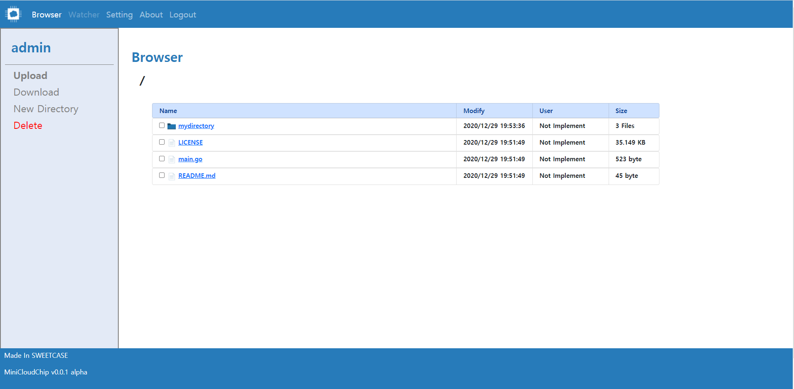

# MicroCloudChip
<br>


<br>


<br>

딱 최소한의 기능을 갖춘 NAS Cloud Web Application
* * *

* * *
## 주요 기능
* 최소한의 클라우드 기능
    * 파일 업로드/다운로드
    * 여러 파일이나 디렉토리를 zip으로 묶어 다운로드 가능
    * 디렉토리 생성 가능
* 계정
    * admin의 권한 하에 계정 관리 가능
* 최초 부팅시 admin의 아이디와 비밀번호는 admin, admin
* * *
## How To run
### As User 
* Docker Container
    * ```shell
        $ sudo docker run -it -d -p 8000:8000 --name [아무거나] -e IP=0.0.0.0 -e PORT=8000 recomadock/microcloudchip:0.2.0
        ```
    * 정상적으로 완료되었으면 chrome으로 hostname:8000/microcloudchip로 접속하면 사용 가능합니다.
    * [참고](https://hub.docker.com/r/recomadock/microcloudchip/tags?page=1&ordering=last_updated)
* Run By Source Code 
    * ```shell
        $ sudo apt install -y vim gcc make zlib1g-dev zlib1g
        $ sudo apt install python3-venv
        $ git clone https://github.com/SweetCase-BakHwa-Project/MicroCloudChip.git
        $ cd MicroCloudChip/bin
        $ perl install.pl
        $ perl run.pl
    ```

* IP, PORT는 선택이며 설정을 하지 않았을 경우의 default값은 0.0.0.0:8000이 됩니다.
### As Developer
* Localhost에서 개발하는 케이스를 위주로 설명하였습니다.
* As User처럼 Linux환경(또는 wsl)에서만 가능합니다.
```shell
$ git clone https://github.com/SweetCase-BakHwa-Project/MicroCloudChip.git
$ cd MicroCloudChip/app/app
$ vim config.json
```
 config.json은 최상위 루트를 정할 때 사용되므로 원하는 루트로 수정합니다.
 <br>수정을 마쳤으면 아래와 같이 명령어를 입력합니다.
```shell
$ cd .. (in ~/MicroCloudChip/app)
$ sh refresh.sh
$ python manage.py runserver
```
* 정상적으로 작동이 되었으면 chrome으로 localhost:8000/microcloudchip으로 접속이 가능합니다.
* * *
## 업데이트 예정인 항목
* v0.4.0
   * 각 User가 고유의 저장공간을 가짐
* v1.0.0
   * 지금 까지 발생한 모든 버그 해결
   * User간 공유 기능 추가
   * Admin이 User의 최대 저장 용량 조절 가능
